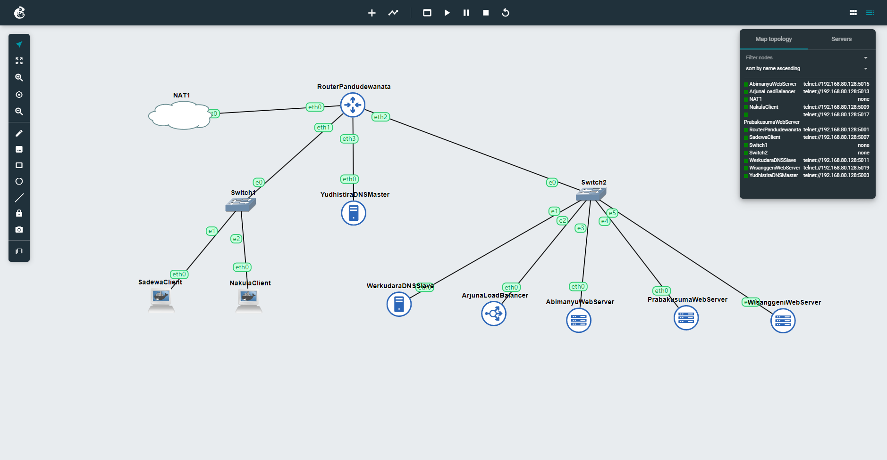

# Jarkom-Modul-2-D13-2023

<table>
<tbody>
  <thead>
    <tr>
      <th>Name</th>
      <th>NRP</th>
    </tr>
  </thead>
  <tbody>
    <tr>
      <td>Thalent Athalla Razzaq</td>
      <td>5025211101</td>
    </tr>
    <tr>
      <td> Jawahirul Wildan </td>
      <td> 5025211150 </td>
  </tbody>
</table>

## Soal
1. Yudhistira akan digunakan sebagai DNS Master, Werkudara sebagai DNS Slave, Arjuna merupakan Load Balancer yang terdiri dari beberapa Web Server yaitu Prabakusuma, Abimanyu, dan Wisanggeni. Buatlah topologi dengan pembagian sebagai berikut. Folder topologi dapat diakses pada drive berikut
2. Buatlah website utama pada node arjuna dengan akses ke **arjuna.yyy.com** dengan alias **www.arjuna.yyy.com** dengan yyy merupakan kode kelompok.
3. Dengan cara yang sama seperti soal nomor 2, buatlah website utama dengan akses ke **abimanyu.yyy.com** dan alias **www.abimanyu.yyy.com**.
4. Kemudian, karena terdapat beberapa web yang harus di-deploy, buatlah subdomain **parikesit.abimanyu.yyy.com** yang diatur DNS-nya di Yudhistira dan mengarah ke Abimanyu.
5. Buat juga reverse domain untuk domain utama. (_Abimanyu saja yang direverse_)
6. Agar dapat tetap dihubungi ketika DNS Server Yudhistira bermasalah, buat juga Werkudara sebagai DNS Slave untuk domain utama.
7. Seperti yang kita tahu karena banyak sekali informasi yang harus diterima, buatlah subdomain khusus untuk perang yaitu **baratayuda.abimanyu.yyy.com** dengan alias **www.baratayuda.abimanyu.yyy.com** yang didelegasikan dari Yudhistira ke Werkudara dengan IP menuju ke Abimanyu dalam folder Baratayuda.
8. Untuk informasi yang lebih spesifik mengenai Ranjapan Baratayuda, buatlah subdomain melalui Werkudara dengan akses **rjp.baratayuda.abimanyu.yyy.com** dengan alias **www.rjp.baratayuda.abimanyu.yyy.com** yang mengarah ke Abimanyu.
9. Arjuna merupakan suatu Load Balancer Nginx dengan tiga worker (yang juga menggunakan nginx sebagai webserver) yaitu Prabakusuma, Abimanyu, dan Wisanggeni. Lakukan deployment pada masing-masing worker.
10. Kemudian gunakan algoritma **Round Robin** untuk Load Balancer pada **Arjuna**. Gunakan _server_name_ pada soal nomor 1. Untuk melakukan pengecekan akses alamat web tersebut kemudian pastikan worker yang digunakan untuk menangani permintaan akan berganti ganti secara acak. Untuk webserver di masing-masing worker wajib berjalan di port 8001-8003. Contoh
    - _Prabakusuma:8001_
    - _Abimanyu:8002_
    - _Wisanggeni:8003_
11. Selain menggunakan Nginx, lakukan konfigurasi Apache Web Server pada worker Abimanyu dengan web server **www.abimanyu.yyy.com**. Pertama dibutuhkan web server dengan DocumentRoot pada /var/www/abimanyu.yyy
12. Setelah itu ubahlah agar url **www.abimanyu.yyy.com/index.php/home** menjadi **www.abimanyu.yyy.com/home**.
13. Selain itu, pada subdomain **www.parikesit.abimanyu.yyy.com**, DocumentRoot disimpan pada /var/www/parikesit.abimanyu.yyy
14. Pada subdomain tersebut folder /public hanya dapat melakukan _directory listing_ sedangkan pada folder /secret tidak dapat diakses (_403 Forbidden_).
15. Buatlah kustomisasi halaman error pada folder /error untuk mengganti error kode pada Apache. Error kode yang perlu diganti adalah 404 Not Found dan 403 Forbidden.
16. Buatlah suatu konfigurasi virtual host agar file asset **www.parikesit.abimanyu.yyy.com/public/js** menjadi **www.parikesit.abimanyu.yyy.com/js**
17. Agar aman, buatlah konfigurasi agar **www.rjp.baratayuda.abimanyu.yyy.com** hanya dapat diakses melalui port 14000 dan 14400.
18. Untuk mengaksesnya buatlah autentikasi username berupa “Wayang” dan password “baratayudayyy” dengan yyy merupakan kode kelompok. Letakkan DocumentRoot pada /var/www/rjp.baratayuda.abimanyu.yyy.
19. Buatlah agar setiap kali mengakses IP dari Abimanyu akan secara otomatis dialihkan ke **www.abimanyu.yyy.com (alias)**
20. Karena website **www.parikesit.abimanyu.yyy.com** semakin banyak pengunjung dan banyak gambar gambar random, maka ubahlah request gambar yang memiliki substring “abimanyu” akan diarahkan menuju abimanyu.png.

PS:

- **yyy** pada url adalah **kode kelompok anda**
- File requirement dapat diakses melalui drive berikut.

## Soal 1
Yudhistira akan digunakan sebagai DNS Master, Werkudara sebagai DNS Slave, Arjuna merupakan Load Balancer yang terdiri dari beberapa Web Server yaitu Prabakusuma, Abimanyu, dan Wisanggeni. Buatlah topologi dengan pembagian sebagai berikut. Folder topologi dapat diakses pada drive berikut
### Penyelesaian
### Topologi



### Setup DNS Master
> _named.conf.local_ pada **Yudhistira**

```vim
zone "arjuna.d13.com" {
	type master;
	notify yes;
	also-notify { 10.28.3.2; }; //Masukkan IP Werkudara
	allow-transfer { 10.28.3.2; }; //Masukkan IP Werkudara
	file "/etc/bind/jarkom/arjuna.d13.com";
};
zone "abimanyu.d13.com" {
	type master;
	notify yes;
	also-notify { 10.28.3.2; }; //Masukkan IP Werkudara
	allow-transfer { 10.28.3.2; }; //Masukkan IP Werkudara
	file "/etc/bind/jarkom/abimanyu.d13.com";
};
zone "3.28.10.in-addr.arpa" {
    type master;
    file "/etc/bind/jarkom/3.28.10.in-addr.arpa";
};
```

> _Arjuna Zone_ pada **Yudhistira**

```vim
;
; BIND data file for local loopback interface
;
$TTL    604800
@       IN      SOA     arjuna.d13.com. root.arjuna.d13.com. (
                     2023101101         ; Serial
                         604800         ; Refresh
                          86400         ; Retry
                        2419200         ; Expire
                         604800 )       ; Negative Cache TTL
;
@       IN      NS      arjuna.d13.com.
@       IN      A       10.28.3.3	;IP ArjunaLoadBalancer
www	IN	CNAME	arjuna.d13.com.
@       IN      AAAA    ::1 
```
## Soal 2
Buatlah website utama pada node arjuna dengan akses ke arjuna.yyy.com dengan alias www.arjuna.yyy.com dengan yyy merupakan kode kelompok.

### Penyelesaian

    `arjuna.d13.com mempunyai IP Address 10.28.3.3 yang mengarah ke node arjuna.`

> _Abimanyu Zone_ pada **Yudhistira**

```vim
;
; BIND data file for local loopback interface
;
$TTL    604800
@       IN      SOA     abimanyu.d13.com. root.abimanyu.d13.com. (
                     2023101101         ; Serial
                         604800         ; Refresh
                          86400         ; Retry
                        2419200         ; Expire
                         604800 )       ; Negative Cache TTL
;
@       	IN      NS      abimanyu.d13.com.
@       	IN      A       10.28.3.4	;IP AbimanyuWebServer
www		IN	CNAME	abimanyu.d13.com.
parikesit	IN	A	10.28.3.4	;IP AbimanyuWebServer
ns1		IN	A	10.28.3.4	;IP AbimanyuWebServer
baratayuda	IN	NS	ns1
@       	IN      AAAA    ::1
```
## Soal 3
Dengan cara yang sama seperti soal nomor 2, buatlah website utama dengan akses ke abimanyu.yyy.com dan alias www.abimanyu.yyy.com.
### Penyelesaian
  
    `abimanyu.d13.com mempunyai IP Address 10.28.3.4 yang mengarah ke node abimanyu`

## Soal 4
Kemudian, karena terdapat beberapa web yang harus di-deploy, buatlah subdomain **parikesit.abimanyu.yyy.com** yang diatur DNS-nya di Yudhistira dan mengarah ke Abimanyu.
### Penyelesaian

    `parikesit.abimanyu.d13.com merupakan subdomain dari abimanyu.d13.com dengan IP Address 10.28.3.4 yang mengarah ke node abimanyu`

> _Reverse Zone_ pada **Yudhistira**

```vim
;
; BIND data file for local loopback interface
;
$TTL    604800
@       IN      SOA     abimanyu.d13.com. root.abimanyu.d13.com. (
                     2023101101         ; Serial
                         604800         ; Refresh
                          86400         ; Retry
                        2419200         ; Expire
                         604800 )       ; Negative Cache TTL
;
3.28.10.in-addr.arpa.	IN	NS	abimanyu.d13.com.
4			IN	PTR	abimanyu.d13.com. ;Byte ke-4 YudhistiraDNSMaster
```
## Soal 5
Buat juga reverse domain untuk domain utama. (_Abimanyu saja yang direverse_)
### Penyelesaian
   
   `Karena abimanyu.d13.com memiliki IP 10.28.3.4, maka reverse nya adalah 3.28.10.in-addr.arpa`

> _named.conf.options_ pada **Yudhistira**

```vim
options {
  directory "/var/cache/bind";
  //dnssec-validation auto;
  allow-query{any;};
  auth-nxdomain no;    # conform to RFC1035
  listen-on-v6 { any; };
};
```

### Setup DNS Slave
> _named.conf.local_ pada **Werkudara**

```vim
zone "arjuna.d13.com" {
	type slave;
	masters { 10.28.2.2; }; // Masukan IP	Yudhistira
	file "/var/lib/bind/arjuna.d13.com";
};

zone "abimanyu.d13.com" {
	type slave;
	masters { 10.28.2.2; }; // Masukan IP	Yudhistira
	file "/var/lib/bind/abimanyu.d13.com";
};

zone "baratayuda.abimanyu.d13.com" {
	type master;
	file "/etc/bind/delegasi/baratayuda.abimanyu.d13.com";
};
```
## Soal 6

### Penyelesaian

## Soal 7

### Penyelesaian

## Soal 8

### Penyelesaian

## Soal 9
Arjuna merupakan suatu Load Balancer Nginx dengan tiga worker (yang juga menggunakan nginx sebagai webserver) yaitu Prabakusuma, Abimanyu, dan Wisanggeni. Lakukan deployment pada masing-masing worker.

### Penyelesaian

## Soal 10
Kemudian gunakan algoritma **Round Robin** untuk Load Balancer pada **Arjuna**. Gunakan server_name pada soal nomor 1. Untuk melakukan pengecekan akses alamat web tersebut kemudian pastikan worker yang digunakan untuk menangani permintaan akan berganti ganti secara acak. Untuk webserver di masing-masing worker wajib berjalan di port 8001-8003. Contoh
    - Prabakusuma:8001
    - Abimanyu:8002
    - Wisanggeni:8003

### Penyelesaian
- Pertama, untuk ketiga node yaitu **Abimanyu, Prabakusuma, Wisanggeni**, lakukan perintah
  ```
  apt-get update && apt install wget unzip nginx php php-fpm -y
  ```
- Kedua, download file requirement yaitu arjuna.yyy.com.zip dengan perintah
  ```
  wget -O arjuna.zip 'https://drive.google.com/uc?export=download&id=17tAM_XDKYWDvF-JJix1x7txvTBEax7vX'
  ```
  lalu unzip file ```unzip arjuna.zip```, lalu pindah dan hapus file zip nya ```mv arjuna.yyy.com /var/www/jarkom``` ```rm arjuna.zip```
- Ketiga, edit file(konfigurasi server) pada direktori ```/etc/nginx/sites-available/jarkom```, seperti dibawah ini :
  ```
  server {
    listen 8001;

    root /var/www/jarkom;
  	index index.php index.html index.htm;
  	server_name arjuna;

	location / {
			try_files $uri $uri/ /index.php?$query_string;
	}

	# pass PHP scripts to FastCGI server
 	location ~ \.php$ {
 	include snippets/fastcgi-php.conf;
 	fastcgi_pass unix:/var/run/php/php7.0-fpm.sock;
 	}

  location ~ /\.ht {
 			deny all;
 	}

 	error_log /var/log/nginx/jarkom_error.log;
 	access_log /var/log/nginx/jarkom_access.log;
  }
  ```
  Port (Wajib disesuaikan dengan Node nya masing masing):<br>
  - Abimanyu:8001
  - Prabakusuma:8002
  - Wisanggeni:8003
- Keempat, simpan file, kemudian buat ```symlink```
  ```
  ln -s /etc/nginx/sites-available/jarkom /etc/nginx/sites-enabled
  ```
- Kelima, remove file default dengan cara
  ```
  rm -rf /etc/nginx/sites-enabled/default
  ```
- Keenam, restart nginx dan start apache2
  ```
  service nginx restart

  service php7.0-fpm start
  ```
- Ketujuh, pada node **Arjuna** lakukan perintah
  ```
  apt-get update && apt-get install nginx -y
  ```
- Kedelapan, buatlah file baru di direktori ```/etc/nginx/sites-available``` dengan nama ```lb-jarkom```, lalu isi dengan
  ```
  # Default menggunakan Round Robin
  upstream myweb  {
    server 10.28.3.4:8001; #IP Abimanyu
    server 10.28.3.5:8002; #IP Prabakusuma	
    server 10.28.3.6:8003; #IP Wisanggeni
   }

  server {
  	listen 80;
  	server_name arjuna;
  
  	location / {
  	proxy_pass http://myweb;
  	}
  }
  ```
- Kesembilan, simpan file, kemudian buat ```symlink```
  ```
  ln -s /etc/nginx/sites-available/lb-jarkom /etc/nginx/sites-enabled
  ```
- Kesepuluh, remove file default dengan cara
  ```
  rm -rf /etc/nginx/sites-enabled/default
  ```
  Abimanyu<br>
  
  Prabakusuma<br>
  
  Wisanggeni<br>
  
## Soal 11
Selain menggunakan Nginx, lakukan konfigurasi Apache Web Server pada worker Abimanyu dengan web server **www.abimanyu.yyy.com**. Pertama dibutuhkan web server dengan DocumentRoot pada /var/www/abimanyu.yyy
### Penyelesaian
- Pertama, pada Node **Abimanyu** lakukan perintah
  ```
  apt-get update && apt-get install apache2 php libapache2-mod-php7.0 -y
  ```
- Kedua, download file requirement yaitu abimanyu.yyy.com.zip dengan perintah
  ```
  wget -O abimanyu.zip 'https://drive.google.com/uc?export=download&id=1a4V23hwK9S7hQEDEcv9FL14UkkrHc-Zc'
  ```
  lalu unzip file ```unzip abimanyu.zip```, lalu pindah dan hapus file zip nya ```mv abimanyu.yyy.com /var/www/abimanyu.d13``` ```rm abimanyu.zip```
- Ketiga, lakukan perintah
  ```
  cp /etc/apache2/sites-available/000-default.conf /etc/apache2/sites-available/abimanyu.d13.com.conf
  ```
- Keempat, edit isi file di direktori ```/etc/apache2/sites-available/abimanyu.d13.com.conf``` seperti dibawah ini
```
<VirtualHost *:80>
  ServerName abimanyu.d13.com
          
  ServerAdmin webmaster@localhost
  DocumentRoot /var/www/abimanyu.d13
  ServerAlias www.abimanyu.d13.com
  
  ErrorLog ${APACHE_LOG_DIR}/error.log
  CustomLog ${APACHE_LOG_DIR}/access.log combined
</Virtualhost>
```
- Kelima, aktifkan konfigurasi menggunakan perintah a2ensite
  ```
  a2ensite abimanyu.d13.com
  ```
- Keenam, lakukan restart pada apache2
  ```
  service apache2 restart
  ```
  
## Soal 12
Setelah itu ubahlah agar url **www.abimanyu.yyy.com/index.php/home** menjadi **www.abimanyu.yyy.com/home**.
### Penyelesaian
- Pertama, buatlah direktori baru
  ```
  mkdir /var/www/abimanyu.d13/home
  ```
- Kedua, edit isi file di direktori ```/etc/apache2/sites-available/abimanyu.d13.com.conf``` seperti dibawah ini
  ```
    <VirtualHost *:80>
    ServerName abimanyu.d13.com
            
    ServerAdmin webmaster@localhost
    DocumentRoot /var/www/abimanyu.d13
    ServerAlias www.abimanyu.d13.com
    <Directory /var/www/abimanyu.d13.com/home>
    Options +Indexes
    </Directory>
    Redirect permanent /index.php/home http://www.abimanyu.d13.com/home/
    ErrorLog ${APACHE_LOG_DIR}/error.log
    CustomLog ${APACHE_LOG_DIR}/access.log combined
    </Virtualhost>
  ```
- ketiga, lakukan restart pada apache2
  ```
  service apache2 restart
  ```
  
## Soal 13
Selain itu, pada subdomain **www.parikesit.abimanyu.yyy.com**, DocumentRoot disimpan pada /var/www/parikesit.abimanyu.yyy
### Penyelesaian
- Pertama, pada Node **Abimanyu** download file requirement yaitu parikesit.abimanyu.yyy.com.zip dengan perintah
  ```
  wget -O parikesit.zip 'https://drive.google.com/uc?export=download&id=1LdbYntiYVF_NVNgJis1GLCLPEGyIOreS'
  ```
  lalu unzip file ```unzip parikesit.zip```, lalu pindah dan hapus file zip nya ```mv parikesit.abimanyu.yyy.com /var/www/parikesit.abimanyu.d13``` ```rm parikesit.zip```
- Kedua, edit isi file di direktori ```/etc/apache2/sites-available/parikesit.abimanyu.d13.com.conf``` seperti dibawah ini
  ```
  <VirtualHost *:80>
    ServerName parikesit.abimanyu.d13.com
            
    ServerAdmin webmaster@localhost
    DocumentRoot /var/www/parikesit.abimanyu.d13
    ServerAlias http://www.parikesit.abimanyu.d13.com
    
    ErrorLog ${APACHE_LOG_DIR}/error.log
    CustomLog ${APACHE_LOG_DIR}/access.log combined
  </Virtualhost>
  ```
- Ketiga, aktifkan konfigurasi menggunakan perintah a2ensite
  ```
  a2ensite parikesit.abimanyu.d13.com
  ```
- Keempat, lakukan restart pada apache2
  ```
  service apache2 restart
  ```
  
## Soal 14
Pada subdomain tersebut folder /public hanya dapat melakukan directory listing sedangkan pada folder /secret tidak dapat diakses (403 Forbidden).
### Penyelesaian
- Pertama, pada Node **Abimanyu**  buatlah directory baru
  ```
  mkdir /var/www/parikesit.abimanyu.d13/secret
  ```
- Kedua, edit isi file di direktori ```/etc/apache2/sites-available/parikesit.abimanyu.d13.com.conf``` seperti dibawah ini
  ```
  <VirtualHost *:80>
	ServerName parikesit.abimanyu.d13.com
	        
	ServerAdmin webmaster@localhost
	DocumentRoot /var/www/parikesit.abimanyu.d13
	ServerAlias http://www.parikesit.abimanyu.d13.com
		
	<Directory /var/www/parikesit.abimanyu.d13/public>
		Options +Indexes
	</Directory>
	<Directory /var/www/parikesit.abimanyu.d13/secret>
		Options -Indexes +FollowSymLinks
	</Directory>
	
	ErrorLog ${APACHE_LOG_DIR}/error.log
	CustomLog ${APACHE_LOG_DIR}/access.log combined
  </Virtualhost>
  ```
  - Ketiga, ubah isi file di direktori ```/var/www/parikesit.abimanyu.d13/secret/.htaccess``` seperti dibawah ini
  ```
  Require all denied
  ```
  - Keempat, lakukan restart pada apache2
  ```
  service apache2 restart
  ```
  /public<br>
  
  /secret<br>
  
## Soal 15
Buatlah kustomisasi halaman error pada folder /error untuk mengganti error kode pada Apache. Error kode yang perlu diganti adalah 404 Not Found dan 403 Forbidden.
### Penyelesaian
- Pertama, edit isi file di direktori ```/etc/apache2/sites-available/parikesit.abimanyu.d13.com.conf``` seperti dibawah ini
  ```
  <VirtualHost *:80>
	ServerName parikesit.abimanyu.d13.com
	        
	ServerAdmin webmaster@localhost
	DocumentRoot /var/www/parikesit.abimanyu.d13
	ServerAlias http://www.parikesit.abimanyu.d13.com
		
	<Directory /var/www/parikesit.abimanyu.d13/public>
		Options +Indexes
	</Directory>
	<Directory /var/www/parikesit.abimanyu.d13/secret>
		Options -Indexes +FollowSymLinks
	</Directory>
	
	ErrorDocument 403 /error/403.html
	ErrorDocument 404 /error/404.html	
	
	ErrorLog ${APACHE_LOG_DIR}/error.log
	CustomLog ${APACHE_LOG_DIR}/access.log combined
  </Virtualhost>

  ```
   - Kedua, lakukan restart pada apache2
  ```
  service apache2 restart
  ```
  404 Not Found<br>
  
  
  403 Forbidden<br>
  
  
## Soal 16
Buatlah suatu konfigurasi virtual host agar file asset **www.parikesit.abimanyu.yyy.com/public/js** menjadi 
**www.parikesit.abimanyu.yyy.com/js**

### Penyelesaian
- Pertama, edit isi file di direktori ```/etc/apache2/sites-available/parikesit.abimanyu.d13.com.conf``` seperti dibawah ini
  ```
  <VirtualHost *:80>
	ServerName parikesit.abimanyu.d13.com
	        
	ServerAdmin webmaster@localhost
	DocumentRoot /var/www/parikesit.abimanyu.d13
	ServerAlias http://www.parikesit.abimanyu.d13.com
		
	<Directory /var/www/parikesit.abimanyu.d13/public>
		Options +Indexes
	</Directory>
	<Directory /var/www/parikesit.abimanyu.d13/secret>
		Options -Indexes +FollowSymLinks
	</Directory>
	
	ErrorDocument 403 /error/403.html
	ErrorDocument 404 /error/404.html	
	
	Alias /js /var/www/parikesit.abimanyu.d13/public/js
	
	ErrorLog ${APACHE_LOG_DIR}/error.log
	CustomLog ${APACHE_LOG_DIR}/access.log combined
  </Virtualhost>
  ```
  
## Soal 17
Agar aman, buatlah konfigurasi agar **www.rjp.baratayuda.abimanyu.yyy.com** hanya dapat diakses melalui port 14000 dan 14400.

### Penyelesaian


## Soal 18
Untuk mengaksesnya buatlah autentikasi username berupa “Wayang” dan password “baratayudayyy” dengan yyy merupakan kode kelompok. Letakkan DocumentRoot pada /var/www/rjp.baratayuda.abimanyu.yyy.

### Penyelesaian


## Soal 19
Buatlah agar setiap kali mengakses IP dari Abimanyu akan secara otomatis dialihkan ke **www.abimanyu.yyy.com (alias)**
### Penyelesaian


## Soal 20
Karena website** www.parikesit.abimanyu.yyy.com** semakin banyak pengunjung dan banyak gambar gambar random, maka ubahlah request gambar yang memiliki substring “abimanyu” akan diarahkan menuju abimanyu.png.

### Penyelesaian


